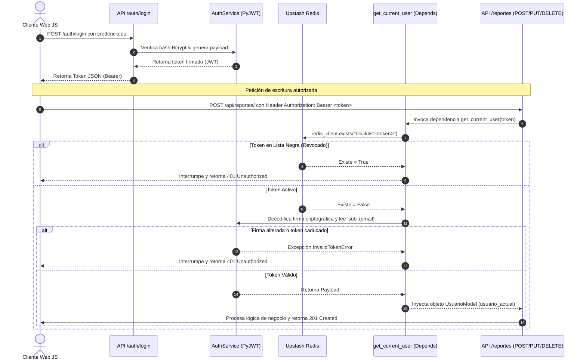
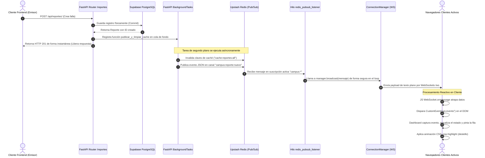

# Detalle Técnico de Flujos y Lógica Asíncrona
## Plataforma **Issue Realtime** (UPDS 2026)

Este documento detalla paso a paso el comportamiento operacional y el flujo de datos que recorren los procesos críticos de la plataforma distribuida **Issue Realtime**. Está redactado en español formal para servir como soporte técnico avanzado en la defensa del proyecto ante el tribunal examinador.

---

## 1. Flujo de Autenticación y Seguridad de Rutas

Este flujo describe la trayectoria desde que un usuario ingresa sus credenciales en la interfaz web hasta que interactúa de forma autorizada con las rutas protegidas del backend.



### Detalle del Paso a Paso:
1.  **Inicio de Sesión (`/auth/login`)**:
    - El cliente envía correo y contraseña en texto plano en una solicitud HTTP POST al endpoint [app/api/endpoints/auth.py:L83](file:///c:/Users/josem/Desktop/pppp/app/api/endpoints/auth.py#L83).
    - El endpoint busca al usuario en Supabase PostgreSQL. Si existe, invoca a `AuthService.verificar_password` en [app/services/auth.py:L43](file:///c:/Users/josem/Desktop/pppp/app/services/auth.py#L43), el cual valida el hash de contraseña utilizando `bcrypt.checkpw`.
    - Al autenticar con éxito, se invoca a `AuthService.crear_access_token` ([app/services/auth.py:L62](file:///c:/Users/josem/Desktop/pppp/app/services/auth.py#L62)) para firmar digitalmente un token JWT que expira en 60 minutos. El token resultante es devuelto en formato JSON.
2.  **Cierre de Sesión (`/auth/logout`)**:
    - El usuario solicita cerrar sesión enviando su JWT activo a `/auth/logout` ([app/api/endpoints/auth.py:L132](file:///c:/Users/josem/Desktop/pppp/app/api/endpoints/auth.py#L132)).
    - El backend decodifica la fecha de expiración del token (`exp`), calcula los segundos de vida útil restantes (TTL) respecto a la hora UTC actual, y almacena una clave temporal en Redis con la estructura `blacklist:<token>` y expiración automática asociada a ese TTL.
3.  **Inyección de Seguridad en Rutas Privadas**:
    - Al consumir un endpoint protegido de reportes, se invoca la dependencia de seguridad `get_current_user` ([app/api/endpoints/reportes.py:L79](file:///c:/Users/josem/Desktop/pppp/app/api/endpoints/reportes.py#L79)) mediante `Depends`.
    - La dependencia realiza una consulta rápida en Redis con la instrucción `redis_client.exists(f"blacklist:{token}")`. Si el token ya fue revocado por un logout, el flujo se interrumpe y retorna un `401 Unauthorized`.
    - Si el token está limpio, se decodifica criptográficamente con `jwt.decode` ([app/api/endpoints/reportes.py:L104](file:///c:/Users/josem/Desktop/pppp/app/api/endpoints/reportes.py#L104)). Al comprobar su integridad y validez, inyecta los datos del usuario en la firma del endpoint para ejecutar el CRUD.

---

## 2. Flujo de Notificaciones en Tiempo Real (Redis Pub/Sub $\rightarrow$ WebSockets)

Este flujo asíncrono y desacoplado de eventos permite propagar en caliente los cambios de estado o la creación de reportes sin degradar la experiencia de usuario del cliente emisor.



### Detalle del Paso a Paso:
1.  **Registro del Reporte y Liberación HTTP**:
    - Un usuario registra una falla en su navegador. El endpoint `crear_reporte` en [app/api/endpoints/reportes.py:L202](file:///c:/Users/josem/Desktop/pppp/app/api/endpoints/reportes.py#L202) recibe la petición, sube la foto a Supabase Storage y realiza el commit atómico en base de datos.
    - Confirmada la base de datos, el enrutador encola el método `publicar_y_limpiar_cache` en la clase `BackgroundTasks` de FastAPI. Inmediatamente después, el servidor responde un `201 Created` al cliente emisor, liberándolo en milisegundos.
2.  **Invalidación de Caché y Publicación de Evento (Capa de Fondo)**:
    - En el hilo de tareas de fondo de FastAPI, la tarea remueve las claves obsoletas del caché global de Redis (`"cache:reportes:all"` y `"cache:reportes:{id}"`).
    - Acto seguido, serializa los datos completos de la falla y publica el JSON en el canal `"campus:reporte:nuevo"` (o `"campus:estado:actualizado"` / `"campus:resuelto"` si fue una edición) utilizando la conexión Pub/Sub de Redis.
3.  **Transmisión WebSocket (Desacoplamiento de Escucha)**:
    - En [app/main.py:L99](file:///c:/Users/josem/Desktop/pppp/app/main.py#L99), el hilo demonio persistente `redis_pubsub_listener` que está suscrito al patrón general `"campus:*"` captura el mensaje enviado a Redis.
    - Mediante `asyncio.run_coroutine_threadsafe`, retransmite de forma segura el mensaje al loop de eventos principal para que la clase `ConnectionManager` haga un broadcast sobre todos los sockets web abiertos en la ruta `/ws`.
4.  **Actualización Atómica Reactiva en la UI**:
    - El archivo centralizado del cliente [frontend/js/services/websocket.js](file:///c:/Users/josem/Desktop/pppp/frontend/js/services/websocket.js) atrapa el mensaje en `websocket.onmessage`.
    - Despacha un evento personalizado del DOM `CustomEvent('ws:evento', { detail: payload })`.
    - Los componentes de los paneles del frontend (`Dashboard.js`, `AdminDashboard.js`, `PersonalDashboard.js`) que se suscribieron con un `window.addEventListener('ws:evento')` interceptan el mensaje.
    - El componente actualiza en caliente su estado local (`this.reportes`) y redibuja la fila del reporte de forma atómica agregando temporalmente la clase `.row-highlight` en CSS ([frontend/css/styles.css](file:///c:/Users/josem/Desktop/pppp/frontend/css/styles.css)) para emitir un destello visual, informando al usuario del cambio sin requerir la recarga manual de la página ni peticiones fetch secundarias de actualización.

---

## 3. Flujo de Aislamiento de Procesos de Consola

Este flujo demuestra cómo la arquitectura distribuida aprovecha el bróker de mensajería para desacoplar procesos secundarios de auditoría que corren aislados de la aplicación web principal.

```text
+-----------------------+              +-----------------------+
|  Proceso Web Principal|              |  Proceso de Consola   |
|   (FastAPI / Uvicorn) |              |   (subscriber.py)     |
+-----------+-----------+              +-----------+-----------+
            |                                      |
     (Emite Evento)                         (Suscrito a)
            |                                      |
            v                                      v
+-----------+--------------------------------------+-----------+
|                      Broker Redis Pub/Sub                     |
+--------------------------------------------------------------+
```

### Detalle del Paso a Paso:
1.  **Ejecución Independiente**: El script [subscriber.py](file:///c:/Users/josem/Desktop/pppp/subscriber.py) se ejecuta en una shell del sistema operativo externa al servidor FastAPI.
2.  **Conexión Directa**: Inicializa un cliente de Redis con `redis.from_url` y genera un objeto `pubsub()`.
3.  **Bloqueo y Captura**: Se suscribe al patrón `"campus:*"` mediante `psubscribe()` y entra en un bucle síncrono bloqueante que escucha mensajes.
4.  **Aislamiento**: Si el servidor de FastAPI se detiene por mantenimiento, el suscriptor de auditoría sigue activo en cola de espera. Al reanudarse las peticiones web, el suscriptor de consola sigue capturando y registrando los eventos de problemas reportados en sus propios archivos de logs históricos sin consumir memoria ni ciclos de procesamiento de la API web.

---

## 4. Flujo de Conexión en la Nube (Pooler vs. Directo)

El backend de **Issue Realtime** aprovecha la arquitectura Serverless de Supabase PostgreSQL mediante dos conexiones diferenciadas que resguardan la salud y escalabilidad del motor relacional.

*   **Peticiones de Aplicación Concurrentes (DATABASE_URL en Puerto 6543)**:
    - Las conexiones de FastAPI son dinámicas y concurrentes. Se enrutan a través del puerto `6543`, el cual conecta con el sistema **PgBouncer (Transaction Pooler)** en Supabase.
    - **Beneficio**: PgBouncer recicla y comparte sockets de conexión física abiertos para procesar miles de peticiones rápidas, previniendo fallas de saturación de conexiones físicas relacionales.
*   **Operaciones Estructurales y Migraciones (DIRECT_URL en Puerto 5432)**:
    - La ejecución física del esquema de base de datos de [bd.sql](file:///c:/Users/josem/Desktop/pppp/bd.sql) o migraciones DDL de base de datos se realizan directamente conectando al puerto estándar de PostgreSQL `5432`.
    - **Beneficio**: Las operaciones estructurales (creación de tablas, llaves foráneas o alteración de columnas) requieren variables de sesión estables e ininterrumpidas, las cuales PgBouncer no tolera por su reciclado rápido de transacciones. Usar el puerto directo garantiza que los cambios físicos DDL se ejecuten de forma segura y sin colisionar con el tráfico diario de la API.
