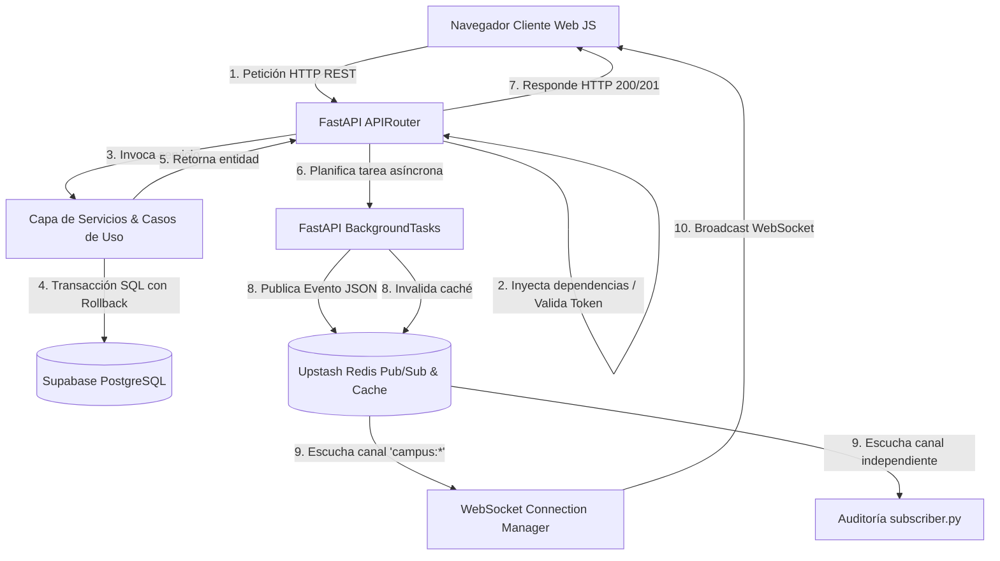

# Guía General del Proyecto - Issue Realtime
## Sistema Distribuido para Reporte de Fallas e Infraestructura en Tiempo Real

Este documento funciona como la bitácora conceptual y descriptiva global de la plataforma **Issue Realtime**, sirviendo de base introductoria para el tribunal de defensa del proyecto final en la materia **Programación IV**.

---

## 1. Definición del Sistema

**Issue Realtime** es una plataforma de software distribuido diseñada específicamente para centralizar, reportar, priorizar y resolver de manera eficiente las incidencias, problemas o fallas de infraestructura física que ocurren cotidianamente dentro del campus universitario de la **UPDS**.

### A. Problemática que Resuelve:
En los entornos universitarios tradicionales, el reporte de fallas físicas (pizarras rotas, aires acondicionados inactivos, cables eléctricos expuestos, cerraduras averiadas) se realiza mediante formularios impresos o correos institucionales lentos que causan cuellos de botella y falta de trazabilidad.
**Issue Realtime** ataca estos problemas mediante:
*   **Centralización Inmediata**: Un estudiante o docente puede registrar la falla físicamente desde su teléfono subiendo evidencias fotográficas en el lugar del hecho.
*   **Trazabilidad Operativa**: Asignación transparente de prioridades (baja, media, alta) y seguimiento histórico de cambios de estado (pendiente, en proceso, resuelto).
*   **Automatización en Tiempo Real**: Notificación inmediata a los paneles administrativos del personal de mantenimiento para iniciar reparaciones de forma ágil sin necesidad de recargar la aplicación web.

### B. Usuarios Beneficiarios:
1.  **Estudiantes y Docentes**: Reportan fallas de forma pública y ven el progreso de sus solicitudes.
2.  **Personal de Mantenimiento / Técnicos**: Visualizan únicamente sus asignaciones activas de reparación en un panel simplificado.
3.  **Administradores del Campus**: Controlan globalmente la priorización de fallas, asignan tareas a técnicos específicos y auditan el historial de resoluciones de problemas.

---

## 2. Mapa Técnico de la Pila de Tecnologías

La arquitectura de **Issue Realtime** se basa en un stack tecnológico moderno, asíncrono y de tipado estricto:

*   **Python**: Lenguaje de programación base, seleccionado por su alta legibilidad, robusto ecosistema de bibliotecas de red y soporte nativo para programación asíncrona.
*   **FastAPI**: Framework web asíncrono de alto rendimiento (basado en Starlette y Pydantic) utilizado para exponer la API REST, documentar con OpenAPI de forma interactiva y gestionar WebSockets nativos con ultra-baja latencia.
*   **SQLAlchemy**: Mapeador objeto-relacional (ORM) para Python, que permite interactuar con la base de datos SQL mediante objetos y transacciones atómicas con mitigación nativa de ataques de inyección SQL.
*   **Supabase PostgreSQL**: Motor de base de datos relacional robusto en la nube que gestiona la persistencia de usuarios, reportes, historial y comentarios de forma segura.
*   **Upstash Redis**: Base de datos en memoria y bróker de mensajería Redis de nivel empresarial, utilizado para centralizar la caché de lectura rápida y publicar eventos distribuidos en tiempo real.
*   **WebSockets Nativos**: Protocolo de comunicación bidireccional sobre un único socket TCP para transferir actualizaciones de eventos en tiempo real desde el backend hacia el navegador del cliente sin la sobrecarga de cabeceras HTTP redundantes.
*   **Pydantic Settings**: Gestión estricta de variables de entorno cargadas desde archivos `.env`, garantizando que la aplicación falle al arrancar si falta alguna credencial requerida.
*   **PyJWT**: Librería para codificación y firma digital de Tokens de Acceso JSON Web Tokens (JWT) utilizando el algoritmo `HS256`.
*   **Bcrypt**: Algoritmo criptográfico especializado en el hashing y salado de contraseñas de usuarios en base de datos.
*   **AWS CloudFormation (IaC)**: Definición declarativa de la infraestructura cloud (AWS S3, DynamoDB con TTL activo, y SSM Parameter Store) para garantizar entornos replicables en la nube.

---

## 3. Arquitectura del Sistema Distribuido

La plataforma **Issue Realtime** implementa una arquitectura desacoplada por capas y basada en eventos (Event-Driven Architecture):



1.  **Capa de Presentación (Frontend)**: Construida en JavaScript nativo estructurado por componentes. Se comunica con el backend mediante HTTP REST tradicional para operaciones CRUD y mantiene una conexión persistente WebSocket `/ws` para recibir notificaciones de eventos reactivos.
2.  **Capa de Enrutamiento y Controladores (FastAPI APIRouter)**: Recibe peticiones HTTP, realiza validaciones sintácticas con Pydantic, comprueba la validez del JWT contra la lista negra de Redis y delega el flujo de negocio.
3.  **Capa de Servicios (Lógica de Negocio)**: Procesa las reglas operativas, realiza búsquedas en caché de Redis antes de consultar la base de datos relacional y realiza commits transaccionales.
4.  **Capa de Persistencia e Infraestructura (Supabase PostgreSQL y Redis)**: Almacena los registros relacionales permanentes e interactúa con el bróker de mensajería para caché y colas de eventos en tiempo real.

---

## 4. Estructura Física del Repositorio

La disposición física de los archivos del proyecto sigue el patrón de separación de responsabilidades:

```text
├── app/                              # Directorio principal del Backend FastAPI
│   ├── api/                          # Capa de controladores HTTP
│   │   └── endpoints/                # Enrutadores divididos por recurso
│   │       ├── auth.py               # Rutas de Registro, Login y Logout
│   │       ├── reportes.py           # CRUD de fallas y comentarios (Rutas protegidas)
│   │       └── usuarios.py           # Rutas para obtener perfiles y listados de usuarios
│   ├── core/                         # Configuración central del sistema
│   │   ├── config.py                 # Validador BaseSettings (Pydantic) de entorno
│   │   └── database.py               # Sesiones SQLAlchemy y manejo del pooler
│   ├── middlewares/                  # Interceptores de peticiones HTTP
│   │   └── rate_limit.py             # Middleware de Rate Limiting por IP usando Redis
│   ├── models/                       # Modelos ORM relacionales de SQLAlchemy
│   │   ├── comentario.py             # Tabla 'comentarios'
│   │   ├── historial.py              # Tabla 'historial_estados'
│   │   ├── reporte.py                # Tabla 'reportes'
│   │   └── usuario.py                # Tabla 'usuarios'
│   ├── redis/                        # Configuración del bróker y caché
│   │   └── client.py                 # Inicialización y validación de conexión a Redis
│   ├── schemas/                      # DTOs de validación sintáctica con Pydantic
│   │   ├── comentario.py             # Esquemas de Comentarios
│   │   ├── reporte.py                # Esquemas de Reportes
│   │   └── usuario.py                # Esquemas de Usuarios
│   ├── services/                     # Capa de lógica de negocio pura
│   │   ├── auth.py                   # Criptografía (Bcrypt, JWT)
│   │   ├── reportes.py               # Reglas de reportes, caché e historial
│   │   └── supabase_storage.py       # Interacción con el bucket S3 de Supabase
│   └── main.py                       # Archivo de arranque, middlewares CORS/Cabeceras y WebSockets
├── cloudformation/                   # Carpeta de Infraestructura como Código (IaC)
│   └── template.yaml                 # Plantilla CloudFormation (S3, DynamoDB TTL, SSM)
├── frontend/                         # Aplicación Web SPA Frontend (HTML5, CSS3, JS ES6)
│   ├── css/                          # Archivos de hojas de estilo (styles.css)
│   ├── js/                           # Lógica del cliente JS estructurada
│   │   ├── components/               # Componentes JS reactivos del DOM
│   │   └── services/                 # Clientes de red (websocket.js, auth.js)
│   └── index.html                    # SPA index
├── subscriber.py                     # Proceso autónomo de consola de auditoría de eventos
├── bd.sql                            # Definición DDL del esquema físico relacional de base de datos
├── requirements.txt                  # Dependencias de paquetes Python
├── .gitignore                        # Archivo de exclusión de control de versiones de Git
└── README.md                         # Portada y documentación de visualización del repositorio
```
